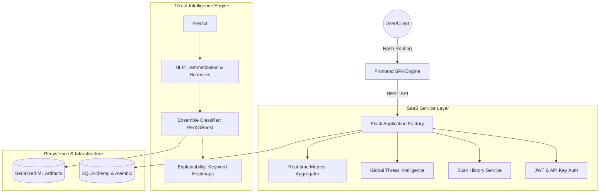

# Sentinel Verify: Enterprise AI-Powered Cybersecurity SaaS Platform

## Overview

Sentinel Verify is a production-grade, full-stack cybersecurity SaaS platform designed to detect and mitigate digital fraud, phishing, and deceptive content. Built on a modern Single Page Application (SPA) architecture, the platform integrates advanced Natural Language Processing (NLP) with Ensemble Machine Learning to provide real-time threat intelligence and explainable detection results.

Transitioning from a prototype to an enterprise-grade solution, the system now features a complete suite of management modules, persistent data storage, and a high-fidelity intelligence dashboard.

---

## System Architecture

The application utilizes a decoupled architecture where a lightweight Vanilla JavaScript frontend communicates with a modular Flask-based REST API.



---

## Core Modules

### 1. Real-time Threat Scanner
The primary analysis engine evaluated via a progressive multi-stage pipeline:
* **Text Analysis**: Detects linguistic patterns in emails, job postings, and messages using TF-IDF and lemmatization.
* **URL Reputation**: Evaluates URL entropy, protocol security, and TLD reputation using heuristic indicators.
* **Explainable AI (XAI)**: Provides keyword-level heatmaps to visualize why specific content was flagged as suspicious.

### 2. Global Threat Feed
A live intelligence stream that aggregates and displays active global cybersecurity threats.
* **Campaign Tracking**: Monitors active phishing and malware campaigns.
* **Risk Categorization**: Automatically ranks threats from Low to Critical severity.
* **Source Attribution**: Tracks intelligence from internal sensors and external security databases.

### 3. Comprehensive Analytics
Visualizes platform metrics and threat trends through an interactive dashboard.
* **Threat Trends**: 7-day visualization of blocked threats versus safe scans.
* **Detection Metrics**: Real-time tracking of total scans, threat detection rates, and model accuracy.
* **Visualization Layer**: Powered by Chart.js for high-performance data rendering.

### 4. Scan History & Persistence
A persistent record of every analysis performed by the system.
* **Data Normalization**: Stores structured prediction results, confidence scores, and XAI metadata.
* **Audit Trail**: Allows users to review, filter, and manage historical scan records.

### 5. API & Developer Ecosystem
Enables enterprise integration through a secure API management system.
* **API Key Management**: Secure generation and revocation of hashed application tokens.
* **Headless Integration**: Allows external applications to leverage the threat engine programmatically.

---

## Technical Specifications

| Component | Specification |
| :--- | :--- |
| **Frontend Architecture** | Vanilla JS Single Page Application (SPA) with Hash-based Routing |
| **Backend Framework** | Flask with Blueprint Modular Architecture |
| **Authentication** | JWT (Stateless) and Bcrypt-hashed API Keys |
| **Database Management** | SQLAlchemy ORM with Alembic Migration Engine |
| **Machine Learning** | Scikit-Learn, Ensemble Random Forest, XGBoost |
| **NLP Engine** | SpaCy (en_core_web_sm), NLTK, Regex Heuristics |
| **UI/UX Design** | CSS3 Grid/Flexbox, Dark Mode Persistence, Lucide Icons |

---

## Installation and Deployment

### Automated Setup (Windows)
The project includes a master automation script for zero-configuration deployment.

1. Ensure Python 3.9 or higher is installed.
2. Navigate to the `scripts/` directory.
3. Run `setup.bat`.

This script initializes the virtual environment, installs dependencies (including the SpaCy language model), prepares the database via migrations, seeds initial data, and launches the application.

### Manual Setup (Linux)
```bash
# Initialize environment
python3 -m venv venv
source venv/bin/activate

# Install dependencies
pip install -r backend/requirements.txt
python -m spacy download en_core_web_sm

# Database initialization
export FLASK_APP=backend/run.py
flask db upgrade
python backend/seed_db.py

# Launch
python backend/run.py
```

---

## API Documentation

The platform exposes a standard RESTful interface under the `/api/v1` prefix:

### Detection Endpoints
* `POST /predict/text`: Analyzes raw text content for fraud and phishing.
* `POST /predict/url`: Analyzes URLs for reputation and phishing markers.

### Management Endpoints
* `GET /history`: Retrieves paginated scan history.
* `GET /feed`: Retrieves the global threat intelligence feed.
* `GET /analytics/overview`: High-level platform KPIs.
* `GET /analytics/trends`: Time-series data for detection trends.
* `POST /apikeys`: Generates a new secure API key.
* `PUT /settings/profile`: Updates user preferences and profile data.

---

## License

This project is licensed under the MIT License.
