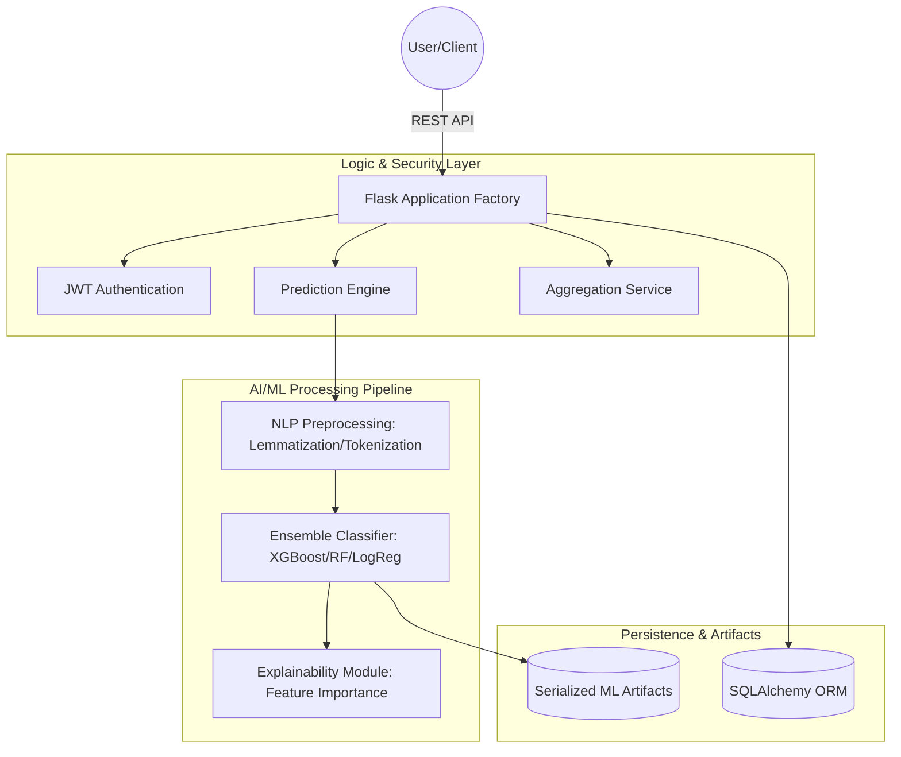

# Sentinel Verify: Enterprise AI-Powered Cybersecurity Platform

## Introduction

Sentinel Verify is a production-grade, full-stack cybersecurity framework engineered to mitigate the risks associated with digital fraud, phishing, and deceptive content. By leveraging advanced Natural Language Processing (NLP) and Ensemble Machine Learning architectures, the platform provides real-time detection and explainable intelligence for high-stakes environments.

The system is designed with a focus on modularity, scalability, and security, making it suitable for enterprise-level deployments, internship evaluations, and academic research projects.

---

## System Architecture

The following diagram illustrates the decoupled architecture of Sentinel Verify, highlighting the flow from client interaction to the deep-learning and heuristic analysis layers.



---

## Core Capabilities

### Advanced Fraud Detection
The platform utilizes a multi-layered approach to identify malicious content:
* **Natural Language Analysis**: Employs TF-IDF vectorization and lemmatization to detect linguistic patterns characteristic of fraudulent job postings and government schemes.
* **URL Intelligence Analysis**: Implements heuristic evaluation of URL entropy, protocol validation (HTTPS), and suspicious character detection to identify phishing attempts.

### Explainable AI (XAI) Implementation
To ensure transparency, the system provides detailed explainability reports for every prediction. By highlighting specific keywords or structural flags that contributed to a "High Threat" score, users can verify the model's decision logic.

### Enterprise Dashboard
A unified interface provides real-time monitoring of security metrics, historical detection trends, and performance analytics visualized through high-fidelity charts.

---

## Technical Specifications

| Component | Specification |
| :--- | :--- |
| **Backend Framework** | Flask with Blueprint Modular Architecture |
| **Authentication** | JSON Web Tokens (JWT) with secure password hashing |
| **Database** | PostgreSQL (Production), SQLite (Local Development) |
| **ML Libraries** | Scikit-Learn, XGBoost, LightGBM, CatBoost |
| **NLP Engine** | SpaCy (en_core_web_sm), NLTK |
| **Frontend Styling** | Vanilla JavaScript, CSS3, Bootstrap 5 |
| **Visualization** | Chart.js for data-driven analytics |

---

## Security and Hardening

The platform implements several layers of security to protect against common vulnerabilities:
* **Input Sanitization**: Comprehensive cleaning of user-provided data to prevent Cross-Site Scripting (XSS) and Injection attacks.
* **Stateless Authentication**: JWT-based security ensures that the application remains scalable while maintaining strict access control.
* **Rate Limiting**: Integrated protection against automated brute-force attacks and API scraping.
* **Environment Isolation**: Configuration parameters and sensitive credentials are isolated from the codebase using environment variables.

---

## Installation and Deployment

### Automated Windows Setup
The project includes a master automation script designed for frictionless deployment on Windows systems.

1. Ensure **Python 3.9+** is installed.
2. Navigate to the `scripts/` directory.
3. Execute `setup.bat`.

This script automates the creation of the virtual environment, dependency management, database initialization, and launches both service layers simultaneously.

### Manual Configuration (Linux/VPS)
For deployment on Linux-based servers or Virtual Private Servers (VPS):

```bash
# Environment Initialization
python3 -m venv venv
source venv/bin/activate

# Dependency Installation
pip install -r backend/requirements.txt
python -m spacy download en_core_web_sm

# Database and App Launch
export FLASK_APP=backend/run.py
flask db upgrade
gunicorn -c deployment/gunicorn.conf.py --chdir backend wsgi:app
```

---

## Machine Learning Development

### Pipeline Overview
The ML pipeline follows a rigorous process:
1. **Preprocessing**: Removal of HTML artifacts, URLs, and non-alphanumeric noise.
2. **Feature Engineering**: Dynamic generation of TF-IDF matrices and URL-specific heuristic features.
3. **Training**: Concurrent training of Logistic Regression and Random Forest models (extendable to BERT).
4. **Serialization**: Models are persisted as binary artifacts for high-performance inference.

### Model Performance Targets
* **Accuracy**: > 92%
* **Precision/Recall**: > 90%
* **API Latency**: < 1.0s

---

## Project Structure

```text
sentinel-verify/
├── backend/            # Service layer logic and AI implementation
│   ├── app/            # Application core (Models, API Blueprints)
│   ├── preprocessing/  # Data transformation logic
│   └── scripts/        # ML training pipelines
├── frontend/           # Presentation layer (Web Dashboard)
├── ai_models/          # Persistence layer for trained models
├── deployment/         # Production server configurations
├── datasets/           # Local storage for training data
└── scripts/            # Automation and utility scripts
```

---

## API Documentation

The platform exposes a RESTful interface for third-party integration:
* `POST /api/v1/predict/text`: Primary endpoint for content analysis.
* `POST /api/v1/predict/url`: Primary endpoint for URL reputation analysis.
* `POST /api/v1/auth/login`: Authentication gateway for secure access.

---

## License

This project is released under the **MIT License**.
