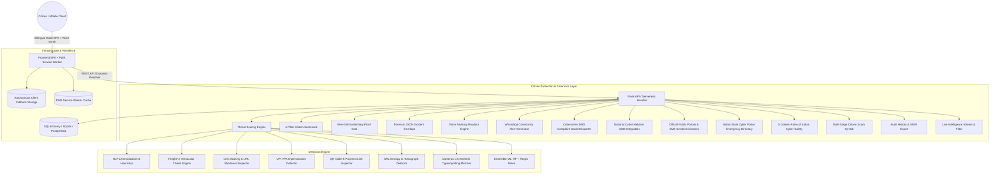

# Sentinel Verify: Citizen AI Anti-Fraud Shield for Digital Public Services

[](https://opensource.org/licenses/MIT)
[](https://www.python.org/downloads/)
[](https://vercel.com)
[](https://netlify.com)
[]()
[]()
[]()

## Overview

**Sentinel Verify** is an AI-powered, full-stack cybersecurity verification platform engineered to protect Indian citizens from digital fraud, fake public-service SMS, deceptive WhatsApp forwards, malicious QR codes, UPI impersonation traps, typosquatting attacks, and phishing links.

While conventional tools only support standard English, Sentinel Verify features **multi-lingual and Hinglish (Hindi-English transliteration) intelligence**, a **bilingual English/Hindi UI**, a **voice readout synthesizer**, an **Official Public Portals & SMS Headers Directory**, and an **offline-first PWA architecture** that instantly identifies deceptive messages impersonating **e-Challan, Electricity Bill (Bijli Vibhag), PM-Kisan, EPFO, Income Tax refunds, IRCTC, and Indian banking portals**.

---

## System Architecture


```mermaid
graph TD
    Client((Citizen / Mobile Client)) -->|Bilingual Hash SPA + Voice Synth| Frontend[Frontend SPA + PWA Service Worker]
    Frontend -->|REST API / Dynamic Resolver| Backend[Flask API / Serverless Handler]
    
    subgraph "Citizen Protection & Forensics Layer"
        Backend --> Scanner[Threat Scoring Engine]
        Backend --> Scorecard[4-Pillar Citizen Scorecard]
        Backend --> Evidence[SHA-256 Evidentiary Proof Seal]
        Backend --> JSONEnvelope[Forensic JSON Incident Envelope]
        Backend --> Voice[Voice Advisory Readout Engine]
        Backend --> WhatsApp[WhatsApp Community Alert Generator]
        Backend --> Docket[Cybercrime 1930 Complaint Docket Exporter]
        Backend --> Helpline[National Cyber Helpline 1930 Integration]
        Backend --> VerifiedDir[Official Public Portals & SMS Senders Directory]
        Backend --> StateDirectory[Indian State Cyber Police Emergency Directory]
        Backend --> GoldenRules[5 Golden Rules of Indian Cyber Safety]
        Backend --> ScamIQ[Multi-Stage Citizen Scam IQ Hub]
        Backend --> History[Audit History & SIEM Export]
        Backend --> Feed[Live Intelligence Stream & Filter]
    end

    subgraph "Detection Engine"
        Scanner --> NLP[NLP Lemmatization & Heuristics]
        Scanner --> Hinglish[Hinglish / Vernacular Threat Engine]
        Scanner --> Shorteners[Link Masking & URL Shortener Inspector]
        Scanner --> UPI[UPI VPA Impersonation Detector]
        Scanner --> QR[QR Code & Payment Link Inspector]
        Scanner --> URLA[URL Entropy & Homograph Detector]
        Scanner --> Typo[Damerau-Levenshtein Typosquatting Matcher]
        Scanner --> Ensemble[Ensemble ML: RF + Regex Rules]
    end

    subgraph "Infrastructure & Resilience"
        Backend --> DB[(SQLAlchemy / SQLite / PostgreSQL)]
        Frontend --> LocalEngine[(Autonomous Client Fallback Storage)]
        Frontend --> PWA[(PWA Service Worker Cache)]
    end
```

---

## Key Features & Citizen Capabilities

### 1. Official Public Portals & SMS Headers Directory
* Interactive searchable reference of state power discoms (*BESCOM, UPPCL, MSEDCL, TANGEDCO*) and national departments (*Parivahan, EPFO, Income Tax, PM-Kisan, IRCTC, UIDAI*) with verified domains and authorized TRAI SMS sender headers (*e.g., `VK-BESCOM`, `AD-PARIVH`, `VM-EPFOHO`*).

### 2. URL Shortener & Link Masking Heuristics
* Automatically flags link obfuscation services (`bit.ly`, `tinyurl.com`, `rb.gy`, `cutt.ly`, `wa.me`, `shorturl.at`) when paired with public service contexts, as government departments and utility boards never use shortened URLs.

### 3. Forensic Digital Evidence JSON Incident Envelope
* 1-click download of a cryptographic JSON audit record containing forensic timestamp, raw evidence snippet, SHA-256 proof seal, triggered heuristic flags, and explainability metadata.

### 4. Indian State Cyber Police Emergency Directory
* Direct contact numbers and official web portals for regional State Police Cyber Crime Wings (*Delhi IFSO, Maharashtra Cyber, UP 112 Cyber Desk, Karnataka CID, Telangana Cyber Bureau, Tamil Nadu Cyber Wing*).

### 5. Cryptographic Evidentiary Proof Seal (SHA-256)
* Generates a tamper-proof digital fingerprint sealing the scan evidence for formal law enforcement, police FIRs, and 1930 reporting.

### 6. Targeted Indian Public Services Threat Breakdown Chart
* Visual analytics dashboard revealing real-time attack frequency across Electricity Discoms (34%), e-Challan (28%), Banking & UPI (22%), PM-Kisan (11%), and EPFO/Tax (5%).

### 7. Multi-Stage Citizen Scam IQ Quiz & Certification
* Dynamic 3-scenario interactive challenge testing citizens against real Indian cyber fraud tactics with a certified completion score badge.

### 8. 5 Golden Rules of Indian Cyber Safety Modal
* Quick-reference cheat sheet summarizing official CERT-In & I4C guidelines (*QR receiving traps, APK trojans, night discom cuts, official Parivahan checks, 1930 Golden Hour rule*).

### 9. Voice Safety Advisory Readout (Listen / बोलकर सुनें)
* Uses the browser's native Web Speech API to read safety instructions aloud in Hindi (`hi-IN`) or English (`en-IN`), making cyber protection inclusive for illiterate, rural, and visually-impaired citizens.

### 10. Bilingual English & Hindi (हिंदी) Accessibility
* Instant 1-click language switcher in the navbar to make cyber verification effortless for citizens across rural and semi-urban India.

### 11. Multi-Lingual & Hinglish Scam Detection
* Detects real-world Indian fraud phrases:
  - *Electricity Disconnection*: *"Priye grahak, aapka bijli connection aaj raat 9:30 baje kat diya jayega... Turant sampark kare."*
  - *Bank / KYC Freeze*: *"Aapka khata block ho gaya hai, turant pan link aur kyc kare..."*
  - *e-Challan / Seizure*: *"Pending challan fine, gadi seize notice issued..."*
  - *Welfare / Subsidy Bait*: *"PM-Kisan 17vi kist claim kare..."*

### 12. UPI VPA & Merchant Impersonation Analyzer
* Deep inspection of `upi://pay` strings to flag personal PSP handles (`@okhdfcbank`, `@paytm`, `@ybl`, `@apl`) deceptively pretending to be verified government utilities.

### 13. 4-Pillar Citizen Security Scorecard
* Delivers an intuitive 4-point breakdown for every scan:
  1. **Brand / Channel Identity**: Verified Official Channel vs Deceptive Spoof
  2. **Psychological Urgency**: Standard Context vs High Pressure Coercion
  3. **Financial / OTP Bait**: Safe vs Demands Money / Sensitive OTP
  4. **Transport Encryption**: Encrypted HTTPS Protocol vs Unencrypted Insecure Transport

### 14. Official Cybercrime Complaint Docket Exporter
* Generates an evidentiary, pre-formatted legal complaint text file ready to upload to **cybercrime.gov.in** or present when calling the **1930 Helpline**.

### 15. WhatsApp Citizen Alert Generator
* 1-click button to copy formatted cybersecurity warnings to protect family & community WhatsApp groups before scams spread.

---

## Deployment & Hosting

### Option A: Deploy on Vercel (Full-Stack Serverless)

Sentinel Verify includes native [`vercel.json`](file:///c:/Users/Romil%20Doshi/Desktop/New%20folder/sentinel/vercel.json) and [`api/index.py`](file:///c:/Users/Romil%20Doshi/Desktop/New%20folder/sentinel/api/index.py) configurations for instant deployment.

```bash
npm i -g vercel
vercel
```

---

### Option B: Deploy on Netlify (Static & Serverless Functions)

Sentinel Verify includes [`netlify.toml`](file:///c:/Users/Romil%20Doshi/Desktop/New%20folder/sentinel/netlify.toml) and native Node.js [`functions/api.js`](file:///c:/Users/Romil%20Doshi/Desktop/New%20folder/sentinel/functions/api.js).

* **Publish directory**: `frontend`
* **Functions directory**: `functions`
* **Autonomous Client Mode**: Runs seamlessly on static previews with built-in client engine fallback.

---

### Option C: Docker & Local Setup

```bash
docker-compose up --build
```
- Frontend UI: `http://localhost:8080`
- Backend API: `http://localhost:5000`

---

## API Endpoints

All endpoints are hosted under `/api/v1`:

| Endpoint | Method | Description |
| :--- | :--- | :--- |
| `/health` | `GET` | Health status, database connectivity, and uptime telemetry |
| `/predict/text` | `POST` | Scans text/email/SMS messages (English & Hinglish) |
| `/predict/url` | `POST` | Analyzes URL reputation, entropy, homographs, typosquatting, shorteners, and UPI VPAs |
| `/predict/batch` | `POST` | High-throughput batch scanning (up to 50 items) |
| `/history` | `GET` | Retrieves paginated historical scan records |
| `/history/export` | `GET` | Exports audit history in JSON or CSV for SIEM integration |
| `/history/<id>` | `DELETE` | Deletes a historical scan record |
| `/feed` | `GET` | Fetches the live global threat intelligence feed |
| `/analytics/overview` | `GET` | Platform KPIs (scans, blocked threats, accuracy) |
| `/analytics/trends` | `GET` | 7-day time-series threat trend datasets |
| `/apikeys` | `GET` / `POST` / `DELETE` | Hashed API token management and usage tracking |
| `/settings/profile` | `GET` / `PUT` | User preferences and profile configuration |

---

## Automated Test Suite

Execute all tests with pytest:
```bash
python -m pytest tests/ -v
```
**36/36 unit and integration tests passing (100% pass rate).**

---

## License

This project is licensed under the MIT License.
